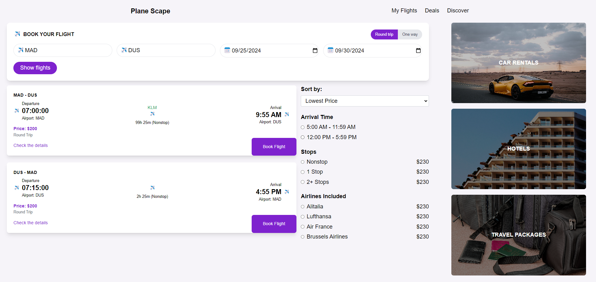
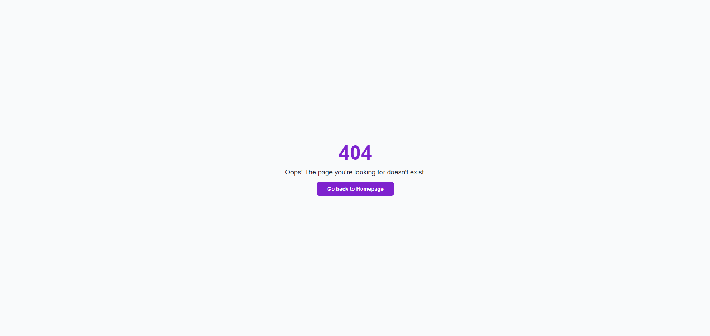

# React Flight Booking App


This project consists of three main pages:
1. **Flight Search and Booking Page**





This project is a **Flight Booking Application** built using **React** and **Vite**. It allows users to search for flights, view flight details, and book flights. The application also provides additional services such as car rentals, hotels, and travel packages.

## Features:
- **Flight Search and Booking**: Users can search for available flights based on departure and arrival airports, select flight types (one-way or round-trip), and book flights.
- **Dynamic Flight Filtering**: Flights can be sorted by price, and users can choose from different filtering options such as stops and airlines.
- **Error Handling**: A custom 404 page is displayed when users navigate to a non-existent route.

## Technologies:
- **React**: Frontend framework used for building the user interface.
- **Vite**: Fast build tool and development server for modern web projects.
- **Tailwind CSS**: Utility-first CSS framework for styling.
- **React Router**: For handling page navigation and routing.
- **MongoDB**: Used for storing flight data.
- **Express.js**: Backend framework used for handling API requests.
- **Mongoose**: For object data modeling (ODM) and MongoDB schema definitions.
- **React Toastify**: For providing notifications when actions like booking a flight are performed.

## Installation and Running the Project

### Prerequisites:
- **Node.js**: Ensure you have Node.js installed (v14 or above is recommended).
- **NPM** or **Yarn**: Install Node Package Manager (npm comes with Node.js) or Yarn to manage dependencies.

### Steps to Run:

1. Install dependencies: Using npm:

```sh
npm install
```

2. Run the development server: Using npm:
```sh
npm run dev
```

3. Build the project (for production): Using npm:
```sh
npm run build
```

Backend Setup:
If your project includes a backend (Express.js with MongoDB), follow these additional steps:

Set up the backend: Ensure that your backend API server is running. It should be connected to MongoDB (using Mongoose).

Start the backend server: After setting up the backend, run:

```sh
npm run server
```


